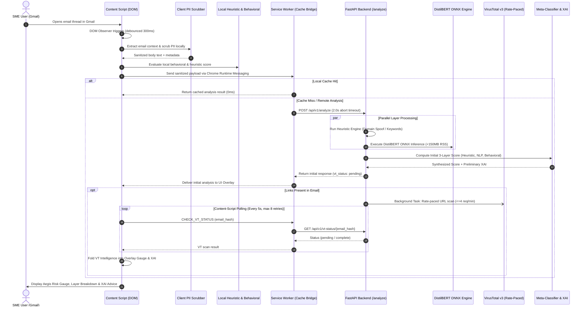

# Aegis: AI-Powered Phishing Context Analyzer for Small and Medium Enterprises
## Technical Implementation Plan & System Architecture Specification

| Document Metadata | Details |
| :--- | :--- |
| **Project Title** | Aegis: AI-Powered Phishing Context Analyzer for Small and Medium Enterprises |
| **Course Code** | IT200D1 — Capstone Project 1 |
| **Proponents** | **Jafphet P. Grengia** (Lead Developer / UX & Usability Lead)<br>**Michael Angelo L. Bernardo** (Co-Developer / Systems & Benchmarking Lead) |
| **Capstone Adviser** | **Mr. Ryan Dalmacio** |
| **Institution** | Mapúa Malayan Digital College (MMDC) |
| **Target Completion** | 5-Week Implementation Sprint (Weeks 1–5) |
| **Document Classification** | Formal Technical Implementation Plan (Faculty Review & Panel Authentication Copy) |
| **Document Version** | 1.0 — Production Specification |

---

## 1. Executive Summary & Problem Context

Small and Medium Enterprises (SMEs) in the Philippines face disproportionate exposure to targeted phishing, Business Email Compromise (BEC), and credential harvesting attacks. Unlike enterprise organizations equipped with Security Operations Centers (SOCs) and dedicated threat intelligence feeds, SMEs operate under severe budgetary, infrastructural, and personnel constraints. Furthermore, enterprise email security gateways often function as black-box filters, offering binary allow/block decisions without actionable, contextual explanations that educate non-technical employees.

**Aegis** addresses this vulnerability by introducing an intelligent, privacy-preserving browser security layer delivered as a **Google Chrome Extension (Manifest V3)** paired with a **self-hosted private machine learning backend (FastAPI)**. Aegis intercepts emails directly within the user's webmail interface (Gmail), evaluates risk across a **4-layer contextual pipeline**, and provides plain-language **Explainable AI (XAI)** threat rationales through a non-disruptive overlay interface.

To address national regulatory mandates under the **Philippine Data Privacy Act of 2012 (Republic Act No. 10173)**, Aegis enforces strict client-side personally identifiable information (PII) redaction prior to any inter-process communication or remote processing. The system also guarantees operational continuity through an autonomous client-side heuristic engine that maintains threat detection capabilities during network outages or backend service degradation.

---

## 2. Project Objectives

### 2.1 General Objective
To design, implement, and empirically validate a lightweight, privacy-preserving, and explainable phishing detection system tailored for SME email workflows that integrates multi-layered heuristic, behavioral, intelligence, and transformer-based neural analysis.

### 2.2 Specific Objectives
1. **Develop a Manifest V3 Chrome Extension**: Construct a client-side extension that injects into Gmail webmail, observes dynamic document object model (DOM) mutations, extracts relevant email artifacts, and redacts sensitive PII locally.
2. **Implement a Self-Hosted Transformer Inference Pipeline**: Deploy a fine-tuned DistilBERT model optimized through ONNX Runtime to execute dedicated private inferences within a constrained memory footprint (<150 MB RSS), avoiding costly external commercial API subscriptions.
3. **Incorporate Multi-Source Intelligence & Anomaly Detection**:
   - Formulate a client-side behavioral baseline module that monitors sender familiarity and circadian timing anomalies using circular clock distance.
   - Integrate an asynchronous, rate-paced VirusTotal v3 URL intelligence scanner with offline caching mechanisms.
4. **Synthesize Transparent Multi-Layered Risk Assessments**: Build a meta-classifier that weights heterogeneous risk signals into a composite Aegis Risk Score (0–100%) and generates plain-language XAI explanations.
5. **Implement an Administrative Whitelist with Dynamic Revocation**: Develop a local SME administration dashboard that supports identity whitelisting with automated revocation triggers for domain authentication failures and display-name spoofing.
6. **Empirically Evaluate System Efficacy & Usability**: Conduct controlled usability testing with 10–15 representative SME participants measuring System Usability Scale (SUS) scores, and execute a comparative benchmark matrix evaluating Aegis against established email security solutions.

---

## 3. System Architecture & Workflow

Aegis is divided into two distinct architectural subsystems: the **Client-Side Extension Subsystem** running in the browser sandbox, and the **Private Backend Inference Subsystem** operating in a lightweight containerized environment.

### 3.1 End-to-End System Workflow



---

## 4. Architectural Decisions & Technical Specifications

The following architectural choices have been established to balance detection accuracy, system responsiveness, regulatory compliance, and cloud hosting feasibility.

| Architectural Dimension | Approved Selection | Engineering Justification |
| :--- | :--- | :--- |
| **Extension Framework** | Google Chrome Extension (Manifest V3) | Mandated by modern Chromium standards; uses background service workers and strictly declared web-accessible resources. |
| **Client-Side Privacy Engine** | Regex-based token redaction in Content Script | Ensures zero sensitive personal information (PII) exits the DOM execution boundary, satisfying RA 10173 mandates. |
| **Natural Language Model** | DistilBERT (`lemonade-sdk/phishing-email-detection-distilbert-ONNX`) | Fine-tuned transformer on phishing corpora. Executed via ONNX Runtime CPU engine to restrict memory consumption to <150MB RSS (preventing OOM errors on 512MB hosting limits). |
| **Private Backend Server** | Python 3.11 / FastAPI with Uvicorn | High-throughput asynchronous API framework supporting lifespan model warmup, background tasks, and structured schema validation. |
| **External Threat Intelligence** | VirusTotal v3 API (Public Free Tier) | Provides authoritative URL reputation data. Enforces strict temporal pacing (15.0s spacing) and an offline seed cache to prevent HTTP 429 quota exhaustion. |
| **Persistence Layer** | `chrome.storage.local` with LRU & TTL Eviction | Local browser storage for behavioral profiles, whitelist configurations, and scan results. Enforces a 100-entry cap and 7-day TTL to prevent quota leaks. |
| **Hosting Infrastructure** | `localhost:8000` (Dev) → Render.com Container (Staging/Production) | Standardized Dockerized deployment packaging both application logic and pre-downloaded ONNX assets into a zero-cold-start container image. |

---

## 5. Subsystem Component Specifications

### 5.1 Client-Side Subsystem (`aegis-extension/`)

```
aegis-extension/
├── manifest.json                   # Extension manifest (MV3 specification)
├── background.js                   # Service Worker: API communication & caching
├── content_script.js               # Gmail DOM extraction, UI injection, polling loop
├── pii_scrubber.js                 # Client-side PII sanitization engine
├── local_heuristics.js             # Autonomous offline fallback engine
├── popup/
│   ├── popup.html                  # Extension toolbar interface
│   ├── popup.js                    # Health check & endpoint configuration
│   └── popup.css                   # Toolbar interface styles
├── overlay/
│   ├── overlay.html                # In-page risk score & XAI presentation panel
│   ├── overlay.js                  # Dynamic gauge updates & threat fold-in logic
│   └── overlay.css                 # Aegis design system & theme stylesheet
├── whitelist/
│   ├── whitelist_dashboard.html    # SME administrator sender management UI
│   └── whitelist.js                # Auto-revocation rules & persistence logic
└── icons/
    ├── icon16.png
    ├── icon48.png
    └── icon128.png
```

#### 5.1.1 Manifest V3 Compliance (`manifest.json`)
The extension adheres to least-privilege security principles:
- **Permissions**: Restricted to `"storage"`. Broad capture permissions such as `"activeTab"` and `"scripting"` are excluded.
- **Host Permissions**: Restricted strictly to `"https://mail.google.com/*"`, `"http://localhost:8000/*"`, and the assigned Render backend domain.
- **Web Accessible Resources**: Explicitly declares `overlay/overlay.html`, `overlay/overlay.css`, and icon assets scoped solely to Gmail origin matching.
- **Content Security Policy**: Prohibits inline scripts; all event bindings are attached programmatically.

#### 5.1.2 DOM Extraction & Resilient Multi-Selector Fallback
To ensure operational resilience against periodic Google Workspace UI updates, `content_script.js` uses fallback selector chains:
- **Subject Selectors**: `['h2.hP', '[data-thread-perm-id] h2', '.ha h2', '[role="main"] h2']`
- **Sender Selectors**: `['span.gD', 'span[email]', '.go span', '[data-hovercard-id]']`
- **Body Selectors**: `['.a3s.aiL', '.ii.gt', '[role="listitem"] .a3s', 'div[dir="ltr"]']`
- **Attachment Selectors**: `['.aV3', '.aZo', '[aria-label*="Attachment"]']`

*Integrity Safeguards*: The extraction engine extracts sender email addresses exclusively from the DOM `email` attribute rather than the `name` attribute, preventing display-name strings from contaminating behavioral hashes or whitelist validations. Total selector failures trigger a non-blocking diagnostic log and graceful execution termination.

#### 5.1.3 Client-Side PII Scrubbing (`pii_scrubber.js`)
In accordance with RA 10173, email body text is scrubbed directly in the content script execution context before inter-process message transfer:
- Personal Names $\rightarrow$ `[NAME]`
- Email Addresses $\rightarrow$ `[EMAIL]`
- Telephone Numbers $\rightarrow$ `[PHONE]`
- Payment Card Numbers $\rightarrow$ `[CARD_NUMBER]`
- Government Identification Numbers $\rightarrow$ `[SSN]`

#### 5.1.4 Service Worker Lifecycle & Asynchronous Message Handling (`background.js`)
Under Manifest V3, background service workers are subject to automatic termination after ~30 seconds of idle time. To prevent dropped network requests:
1. Message listeners synchronously execute `return true`, maintaining the inter-process port while asynchronous operations complete within an immediate execution scope.
2. Long-running polling loops (e.g., waiting for VirusTotal URL analysis) are managed by the content script rather than the service worker. The content script triggers discrete, short-lived status pings to the service worker, keeping execution cycles well under platform timeout thresholds.

#### 5.1.5 Cache Management & Eviction Engine
To prevent storage exhaustion within Chrome's 10 MB quota, `background.js` manages an LRU cache:
- **Maximum Cache Size**: 100 entries.
- **Time-to-Live (TTL)**: 7 days (604,800 seconds).
- **Eviction Protocol**: Prunes expired records on each write operation; evicts oldest entries by timestamp if the capacity ceiling is exceeded.

---

### 5.2 Backend Subsystem (`aegis-backend/`)

```
aegis-backend/
├── main.py                         # FastAPI application entry point & lifespan manager
├── Dockerfile                      # Build configuration baking model & dependencies
├── requirements.txt                # Lightweight runtime dependencies (CPU-only)
├── routes/
│   ├── analyze.py                  # Primary /analyze & /vt-status endpoints
│   └── health.py                   # Health monitoring probe
├── modules/
│   ├── heuristic_engine.py         # Regex rules, domain typosquatting, header checks
│   ├── link_scanner.py             # Rate-paced VirusTotal v3 URL integration
│   ├── nlp_classifier.py           # DistilBERT ONNX runtime inference session
│   ├── behavioral_analyzer.py      # Baseline anomaly processing
│   └── meta_classifier.py          # Heterogeneous score synthesis & XAI generator
├── models/
│   └── phishing_distilbert/        # Vendored ONNX weights & tokenizer assets
├── scripts/
│   ├── download_model.py           # Build-time model acquisition script
│   └── prewarm_vt_cache.py         # Offline URL cache pre-warming utility
└── data/
    ├── vt_seed_cache.json          # Pre-warmed VirusTotal scan results
    └── benchmark_dataset.json      # Standardized evaluation test corpus
```

#### 5.2.1 Container Build & Zero-Cold-Start Asset Baking
To eliminate external Hugging Face Hub dependencies and prevent cold-start latency spikes during container initialization:
1. `scripts/download_model.py` executes during Docker image build time, pre-fetching `model.onnx`, `tokenizer.json`, `tokenizer_config.json`, `vocab.txt`, and `special_tokens_map.json` into `models/phishing_distilbert/`.
2. The runtime environment installs `onnxruntime` (~15 MB) rather than full PyTorch (~1.5 GB), restricting container RSS memory usage to ~140 MB.
3. During FastAPI application lifespan initialization, `warm_up_nlp()` executes a dummy inference pass, ensuring subsequent client requests execute with ~25–50 ms inference latency.

#### 5.2.2 Rate-Paced Threat Intelligence Gateway (`modules/link_scanner.py`)
VirusTotal public API tiers enforce an operational limit of 4 requests per minute. To prevent HTTP 429 quota exhaustion:
1. **Request Capping**: Scan targets are capped at a maximum of 2 hyperlinks per email.
2. **Temporal Pacing**: An asynchronous lock enforces a minimum interval of 15.0 seconds between consecutive outbound network requests:
   $$\Delta t_{\text{interval}} \ge 15.0\text{ seconds}$$
3. **Dual Cache Partitioning**: In-memory cache structures are strictly separated by keyspace:
   - `vt_url_cache`: URL string $\rightarrow$ `{"malicious": bool}`
   - `vt_analysis_cache`: Email SHA-256 hash $\rightarrow$ Re-synthesized composite analysis result
4. **Seed Pre-Warming**: Test scenario URLs are pre-scanned and stored in `data/vt_seed_cache.json`, providing instant lookup responses during usability trials and evaluation sessions.

---

## 6. Multi-Layer Risk Scoring Engine & Mathematical Formulation

Aegis derives its composite threat assessment from four distinct analytical layers.

```
+-----------------------------------------------------------------------+
|                       Aegis Risk Score (0-100%)                       |
+-----------------------------------------------------------------------+
|  Layer 1: Heuristic & Spoofing Analysis               (Weight: 25%)   |
|  Layer 2: DistilBERT NLP Semantic Intent              (Weight: 45%)   |
|  Layer 3: Client Behavioral Anomaly                   (Weight: 15%)   |
|  Layer 4: VirusTotal Link Intelligence                (Weight: 15%)   |
+-----------------------------------------------------------------------+
```

### 6.1 Mathematical Formulation of Risk Synthesis

The composite risk score $R_{\text{final}} \in [0, 100]$ is computed as:

$$R_{\text{final}} = \min\left(100, \text{round}\left(w_1 S_{\text{heuristic}} + w_2 S_{\text{nlp}} + w_3 S_{\text{behavioral}} + w_4 S_{\text{vt}}\right)\right)$$

Where the empirical weights are defined as:
$$w_1 = 0.25, \quad w_2 = 0.45, \quad w_3 = 0.15, \quad w_4 = 0.15 \quad \left(\sum_{i=1}^{4} w_i = 1.00\right)$$

### 6.2 Layer 1: Heuristic & Spoof Detection ($S_{\text{heuristic}}$)
Evaluates deterministic syntactic indicators and domain anomalies:
- **Domain Typosquatting Check**: Computes Levenshtein distance against known brand domains (penalty: +35 points).
- **Keyword Urgency Density**: Scans for coercive financial and operational phrases (scaled: $\min(N_{\text{hits}} \times 8, 30)$ points).
- **Authentication Headers (SPF / DKIM)**: In the webmail DOM context where headers are inaccessible, status is recorded as `null` (unknown) and assigned a neutral score of 0 to avoid false positives. Explicit simulated validation failures apply targeted penalties (+25 for SPF failure, +20 for DKIM failure).

### 6.3 Layer 2: DistilBERT NLP Semantic Intent ($S_{\text{nlp}}$)
Executes neural sequence classification over tokenized email content (truncated to 512 tokens):
1. The ONNX model outputs logit vector $\mathbf{z} = [z_0, z_1, z_2, z_3]$ corresponding to:
   - Index 0 (`LABEL_0`): Legitimate Email
   - Index 1 (`LABEL_1`): Phishing URL Context
   - Index 2 (`LABEL_2`): Legitimate URL Context
   - Index 3 (`LABEL_3`): Alternative Phishing Structure
2. Numerically stable softmax computes class probabilities:
   $$P(k) = \frac{e^{z_k - \max(\mathbf{z})}}{\sum_{j=0}^{3} e^{z_j - \max(\mathbf{z})}}$$
3. The aggregate phishing probability is formulated as the joint probability of indices 1 and 3:
   $$P_{\text{phish}} = P(1) + P(3)$$
4. The base model score is modulated by class confidence:
   $$S_{\text{base}} = \begin{cases} 60 \times P_{\text{phish}}, & \text{if } P_{\text{phish}} > 0.50 \\ 10 \times (1 - P_{\text{phish}}), & \text{otherwise} \end{cases}$$
5. Heuristic pattern adjustments for detected urgency ($S_{\text{urgency}} \le 20$) and Business Email Compromise ($S_{\text{bec}} \le 20$) are added to yield:
   $$S_{\text{nlp}} = \min\left(100, \text{round}\left(S_{\text{base}} + S_{\text{urgency}} + S_{\text{bec}}\right)\right)$$

### 6.4 Layer 3: Behavioral & Temporal Anomaly ($S_{\text{behavioral}}$)
Evaluates deviation from historical interaction baselines stored client-side in `chrome.storage.local`:
- **Circadian Clock Distance**: To eliminate midnight boundary artifacts (where linear averaging of 23:00 and 01:00 produces an erroneous midday 12:00 baseline), temporal deviation is calculated via circular distance:
  $$\Delta t_{\text{circular}}(h_1, h_2) = \min\left(|h_1 - h_2|, 24 - |h_1 - h_2|\right)$$
  For senders with at least 5 recorded interactions, if $\min(\Delta t_{\text{circular}}) > 6\text{ hours}$, an off-hours penalty of +20 points is assigned.
- **Sender Novelty**: First-time senders receive a default neutral baseline of 25 points. Senders with fewer than 3 historical interactions receive an unfamiliarity penalty of +15 points.

### 6.5 Layer 4: Link Intelligence ($S_{\text{vt}}$)
Derived from external VirusTotal URL reputation reports:
$$S_{\text{vt}} = \min(100, N_{\text{malicious\_links}} \times 50)$$
If no links are present, or if external quotas are exceeded, the layer contributes $S_{\text{vt}} = 0$ while the remaining layers represent the assessment.

### 6.6 Risk Classification Thresholds
The continuous composite score $R_{\text{final}}$ maps into categorical risk tiers:
- **Safe** ($R_{\text{final}} < 45\%$): Standard display; informational overlay available on request.
- **Warning** ($R_{\text{final}} \in [45\%, 74\%]$): Amber banner highlighting detected inconsistencies.
- **Critical** ($R_{\text{final}} \ge 75\%$): High-visibility crimson warning requiring explicit user confirmation before interacting with links.

---

## 7. Whitelist Architecture & Dynamic Revocation Rules

The SME Whitelist module enables administrators to register trusted internal and partner identities. Whitelist configurations reside strictly in local client storage.

### 7.1 Dual-Mechanism Auto-Revocation Logic
To counter targeted impersonation attacks where attackers exploit whitelisted standing, Aegis implements automated revocation:

1. **Display-Name Spoofing Detection (DOM Integration)**:
   If an incoming email's display name matches a protected whitelisted identity (e.g., "Executive Director"), but the extracted sender email address does not match the registered domain, the sender's whitelisted status is immediately overridden, a critical alert is generated, and a risk score of 95% is enforced.
2. **Cryptographic Authentication Failure (Synthetic Verification)**:
   If an email originating from a whitelisted address explicitly fails SPF or DKIM validation (`spf_pass == false` or `dkim_pass == false`), whitelist protection is revoked and an alert is issued regarding potential domain spoofing.

---

## 8. 5-Week Implementation Roadmap & Milestones

The technical execution is scheduled over a structured 5-week development lifecycle.

```
+-----------------------------------------------------------------------------+
|                     5-WEEK IMPLEMENTATION TIMELINE                          |
+-----------------------------------------------------------------------------+
| Week 1: Extension Shell & Containerized Backend Foundation                  |
| Week 2: Client PII Scrubber & Rate-Paced Threat Intelligence Gateway       |
| Week 3: DistilBERT ONNX Private Inference & Behavioral Baseline Module      |
| Week 4: Human Usability Study (SUS) & 4-Platform Benchmark Evaluation       |
| Week 5: Quality Assurance, Security Audit, Freeze & Submission Package      |
+-----------------------------------------------------------------------------+
```

### Week 1: Extension Shell & Containerized Backend Foundation
- **Milestone 1.1**: Author `manifest.json` under Manifest V3 specifications with restricted permissions.
- **Milestone 1.2**: Implement `content_script.js` with debounced `MutationObserver` on `[role="main"]` and multi-selector fallback chains.
- **Milestone 1.3**: Adapt visual design from prototype into extension overlay components (`overlay/overlay.html`, `overlay.css`).
- **Milestone 1.4**: Initialize FastAPI service with lifespan event hooks and CORS configuration.
- **Milestone 1.5**: Author Docker build configuration and `download_model.py` to bake ONNX transformer assets into the deployment image.
- **Deliverable**: Functional unpacked extension injecting UI into live Gmail threads; healthy local backend serving `/api/v1/health`.

### Week 2: Client PII Scrubber & Rate-Paced Threat Intelligence Gateway
- **Milestone 2.1**: Implement `pii_scrubber.js` client-side redaction regex engine within the content script context.
- **Milestone 2.2**: Build `local_heuristics.js` offline fallback scoring engine.
- **Milestone 2.3**: Establish asynchronous communication bridge in `background.js` with a 2.0-second network abort timeout.
- **Milestone 2.4**: Implement `link_scanner.py` with 15.0-second request pacing lock, 2-link cap, and separated URL/result cache structures.
- **Milestone 2.5**: Wire background task dispatch in `routes/analyze.py` and implement async score fold-in handlers within `overlay.js`.
- **Deliverable**: End-to-end data pipeline demonstrating PII redaction, heuristic analysis, and asynchronous URL reputation polling.

### Week 3: DistilBERT ONNX Private Inference & Behavioral Baseline Module
- **Milestone 3.1**: Implement `nlp_classifier.py` executing DistilBERT ONNX model inferences with numerical softmax and label mapping.
- **Milestone 3.2**: Implement client-side `updateBehavioralBaseline()` and circular distance scoring in `content_script.js`.
- **Milestone 3.3**: Develop `whitelist_dashboard.html` and administrative management logic with dual-trigger auto-revocation.
- **Milestone 3.4**: Implement `meta_classifier.py` synthesizing the 4-layer weighted risk score and producing plain-language XAI output.
- **Milestone 3.5**: Execute internal validation suite across 50+ diverse test email samples.
- **Deliverable**: Feature-complete prototype capable of 4-layer risk synthesis, local explainability generation, and whitelist protection.

### Week 4: Human Usability Study (SUS) & 4-Platform Benchmark Evaluation
- **Milestone 4.1**: Administer supervised usability testing sessions with 10–15 representative SME participants under institutional ethics guidelines.
- **Milestone 4.2**: Collect and analyze 10-item System Usability Scale (SUS) survey data and log task completion times.
- **Milestone 4.3**: Execute comparative evaluation matrix benchmarking Aegis against Gmail, Microsoft Outlook, ProtonMail, and SpamAssassin.
- **Milestone 4.4**: Implement rapid post-testing UI iterations based on participant feedback (adjusting button affordances and XAI clarity).
- **Deliverable**: Completed usability report with empirical SUS metrics and populated comparative benchmark dataset (`benchmark_matrix.md`).

### Week 5: Quality Assurance, Security Audit, Freeze & Submission Package
- **Milestone 5.1**: Execute cross-browser regression testing across Chromium browsers (Google Chrome and Microsoft Edge).
- **Milestone 5.2**: Conduct privacy and security audit confirming absence of raw body text in local storage and locking CORS configurations.
- **Milestone 5.3**: Verify deployment readiness via memory stress testing (`docker run --memory=512m`) and container hosting deployment.
- **Milestone 5.4**: Generate complete Chapter IV documentation package, sprint logs, bug tracking records, and high-resolution architecture diagrams.
- **Deliverable**: Final prototype code freeze, published GitHub release tag, accessible cloud deployment, and archived academic submission package.

---

## 9. Team Work Breakdown & Responsibilities

To ensure parallel progress without task interference across the 5-week schedule, duties are formally partitioned between the two proponents:

| Phase | Jafphet P. Grengia<br>*(Lead Developer / UX & Usability Lead)* | Michael Angelo L. Bernardo<br>*(Co-Developer / Systems & Benchmarking Lead)* |
| :--- | :--- | :--- |
| **Week 1** | • Content script DOM observer & resilient selector chains<br>• Extension overlay & FAB button injection logic<br>• Manifest V3 configuration & permission scoping | • FastAPI backend skeleton setup & health endpoints<br>• Dockerfile configuration & model baking script<br>• Initial Git repository setup & sprint logging |
| **Week 2** | • Client-side PII scrubber implementation & verification<br>• Local heuristic offline engine (`local_heuristics.js`)<br>• UI overlay score rendering & async update listeners | • VirusTotal v3 API rate-paced link scanner (`link_scanner.py`)<br>• Asynchronous background task polling routes (`/vt-status`)<br>• URL cache pre-warming utility (`prewarm_vt_cache.py`) |
| **Week 3** | • Behavioral baseline tracking & circular hour delta module<br>• Whitelist dashboard UI & client storage persistence<br>• Display-name spoofing auto-revocation detection | • DistilBERT ONNX runtime integration & lifespan warmup<br>• Meta-classifier 4-layer risk synthesis formula<br>• Plain-language XAI explanation generation engine |
| **Week 4** | • Lead 10–15 participant usability sessions<br>• Administer informed consent & SUS survey instruments<br>• Implement UI refinements from usability feedback | • Execute 4-platform comparative benchmark testing<br>• Benchmark latency profiling (<350ms server / <100ms local)<br>• Compile test execution matrix (`test_matrix.md`) |
| **Week 5** | • Cross-browser UI validation (Chrome & Edge)<br>• Usability report compilation (`usability_report.md`)<br>• Demonstration video production & presentation deck | • Security audit & pre-submission deployment validation<br>• Render container deployment & CORS verification<br>• Chapter IV appendices & bug tracker compilation |

---

## 10. Usability & Benchmarking Evaluation Framework

### 10.1 Human Usability Testing Methodology
Usability evaluation is conducted in compliance with Philippine RA 10173 ethical research standards:
- **Cohort Composition**: 10–15 participants representing SME organizational roles (administrative personnel, finance officers, general operations, and IT support).
- **Ethics & Privacy Protocol**: Written informed consent obtained prior to participation; all operational metrics recorded strictly under anonymized participant identifiers (`P01`–`P15`).
- **Standardized Task Scenarios**:
  1. *Scenario A (Phishing Identification)*: Review an urgent credential harvesting email, trigger the Aegis scan, and interpret the resulting risk classification.
  2. *Scenario B (Legitimate Verification)*: Review a standard inter-departmental memorandum and verify benign status.
  3. *Scenario C (Sender Whitelisting)*: Register a trusted operational partner address through the Whitelist Dashboard.
  4. *Scenario D (XAI Comprehension)*: Review the plain-language XAI reasoning box and rate comprehension clarity on a 1–5 Likert scale.
- **Instrument**: Standard 10-item System Usability Scale (SUS) administered via digital questionnaire immediately following scenario completion. Target: Achieve a mean SUS score $\ge 70$ (indicating acceptable to excellent usability).

### 10.2 Comparative Benchmark Testing Matrix
To assess empirical detection performance, Aegis is evaluated alongside four incumbent email filtering platforms using a curated corpus of 50 test cases:

| Evaluation Category | Test Description | Evaluation Benchmark Platforms | Aegis Success Criteria |
| :--- | :--- | :--- | :--- |
| **Traditional Phishing** | Urgency language, typosquatted sender domains, credential links | Gmail, Outlook, ProtonMail, SpamAssassin | Detection rate $\ge 90\%$ |
| **Business Email Compromise** | Executive identity impersonation without hyperlinks or attachments | Gmail, Outlook, ProtonMail, SpamAssassin | Detection rate $\ge 85\%$ |
| **LLM-Synthesized Phishing** | Coercive spear-phishing with clean grammar and zero static blacklist flags | Gmail, Outlook, ProtonMail, SpamAssassin | Detection rate $\ge 70\%$ |
| **Legitimate Communications** | Routine operational emails, newsletters, calendar invitations | Gmail, Outlook, ProtonMail, SpamAssassin | False Positive rate $\le 10\%$ |

---

## 11. Risk Management & Technical Contingency Protocols

| Identified Technical Risk | Severity | Proactive Engineering Mitigation Protocol |
| :--- | :---: | :--- |
| **VirusTotal HTTP 429 Quota Exhaustion** | High | Combine an `asyncio.Lock` with strict 15.0-second sleep pacing across all outbound calls. Pre-scan all evaluation task hyperlinks into `data/vt_seed_cache.json` to guarantee 100% cache hits during live presentations. |
| **Cloud Hosting Memory Exhaustion (OOM)** | High | Discard PyTorch dependencies in favor of `onnxruntime` (<150 MB RSS). Verify local Docker builds under explicit 512 MB memory constraints (`docker run --memory=512m`). |
| **Service Worker Termination in MV3** | High | Delegate long-running polling timers to `content_script.js` in the active tab. Structure `background.js` handlers to wake briefly for single-cycle network fetch relays. |
| **Gmail DOM Class Mutation** | Medium | Implement multi-selector fallback arrays covering semantic attributes (`[role="main"]`, `[data-thread-perm-id]`, `[email]`) rather than volatile obfuscated classes alone. |
| **Inaccessible Raw Email Headers** | Low | Explicitly document webmail DOM sandbox constraints in Chapter IV. Treat null SPF/DKIM values as neutral, validating verification rules through synthetic test suites. |

---

## 12. Authentication & Panel Approval

This document serves as the formal architectural blueprint and project roadmap for the Capstone 1 implementation. By signing below, the faculty adviser and panel members acknowledge the technical validity, ethical compliance, and structural readiness of the proposed system.

<br>

### Proponent Endorsement

We hereby certify that this implementation plan represents our original work, technical design, and scheduled commitments for the completion of Capstone 1.

<br>

_____________________________________________ &nbsp;&nbsp;&nbsp;&nbsp;&nbsp;&nbsp;&nbsp;&nbsp;&nbsp;&nbsp;&nbsp;&nbsp;&nbsp;&nbsp;&nbsp;&nbsp;&nbsp;&nbsp;&nbsp;&nbsp; _____________________________________________
**Jafphet P. Grengia** &nbsp;&nbsp;&nbsp;&nbsp;&nbsp;&nbsp;&nbsp;&nbsp;&nbsp;&nbsp;&nbsp;&nbsp;&nbsp;&nbsp;&nbsp;&nbsp;&nbsp;&nbsp;&nbsp;&nbsp;&nbsp;&nbsp;&nbsp;&nbsp;&nbsp;&nbsp;&nbsp;&nbsp;&nbsp;&nbsp;&nbsp;&nbsp;&nbsp;&nbsp;&nbsp;&nbsp;&nbsp;&nbsp;&nbsp;&nbsp;&nbsp;&nbsp;&nbsp;&nbsp;&nbsp;&nbsp;&nbsp;&nbsp;&nbsp;&nbsp;&nbsp;&nbsp;&nbsp;&nbsp;&nbsp;&nbsp;&nbsp;&nbsp;&nbsp;&nbsp;&nbsp;&nbsp;&nbsp;&nbsp;&nbsp;&nbsp; **Michael Angelo L. Bernardo**
Lead Developer / UX Lead &nbsp;&nbsp;&nbsp;&nbsp;&nbsp;&nbsp;&nbsp;&nbsp;&nbsp;&nbsp;&nbsp;&nbsp;&nbsp;&nbsp;&nbsp;&nbsp;&nbsp;&nbsp;&nbsp;&nbsp;&nbsp;&nbsp;&nbsp;&nbsp;&nbsp;&nbsp;&nbsp;&nbsp;&nbsp;&nbsp;&nbsp;&nbsp;&nbsp;&nbsp;&nbsp;&nbsp;&nbsp;&nbsp;&nbsp;&nbsp;&nbsp;&nbsp;&nbsp;&nbsp;&nbsp;&nbsp;&nbsp;&nbsp;&nbsp;&nbsp;&nbsp;&nbsp; Co-Developer / Systems Lead
Date: ________________________ &nbsp;&nbsp;&nbsp;&nbsp;&nbsp;&nbsp;&nbsp;&nbsp;&nbsp;&nbsp;&nbsp;&nbsp;&nbsp;&nbsp;&nbsp;&nbsp;&nbsp;&nbsp;&nbsp;&nbsp;&nbsp;&nbsp;&nbsp;&nbsp;&nbsp;&nbsp;&nbsp;&nbsp;&nbsp;&nbsp;&nbsp;&nbsp;&nbsp;&nbsp;&nbsp;&nbsp;&nbsp;&nbsp;&nbsp;&nbsp;&nbsp;&nbsp;&nbsp; Date: ________________________

<br><br>

### Faculty Authentication & Approval

Approved in partial fulfillment of the requirements for the degree of Bachelor of Science in Information Technology (BSIT) at Mapúa Malayan Digital College.

<br>

_____________________________________________
**Mr. Ryan Dalmacio**
Capstone Project Adviser
Date: ________________________

<br><br>

_____________________________________________ &nbsp;&nbsp;&nbsp;&nbsp;&nbsp;&nbsp;&nbsp;&nbsp;&nbsp;&nbsp;&nbsp;&nbsp;&nbsp;&nbsp;&nbsp;&nbsp;&nbsp;&nbsp;&nbsp;&nbsp; _____________________________________________
**Technical Critic** &nbsp;&nbsp;&nbsp;&nbsp;&nbsp;&nbsp;&nbsp;&nbsp;&nbsp;&nbsp;&nbsp;&nbsp;&nbsp;&nbsp;&nbsp;&nbsp;&nbsp;&nbsp;&nbsp;&nbsp;&nbsp;&nbsp;&nbsp;&nbsp;&nbsp;&nbsp;&nbsp;&nbsp;&nbsp;&nbsp;&nbsp;&nbsp;&nbsp;&nbsp;&nbsp;&nbsp;&nbsp;&nbsp;&nbsp;&nbsp;&nbsp;&nbsp;&nbsp;&nbsp;&nbsp;&nbsp;&nbsp;&nbsp;&nbsp;&nbsp;&nbsp;&nbsp;&nbsp;&nbsp;&nbsp;&nbsp;&nbsp;&nbsp;&nbsp;&nbsp;&nbsp;&nbsp;&nbsp;&nbsp;&nbsp;&nbsp; **Panel Member**
Date: ________________________ &nbsp;&nbsp;&nbsp;&nbsp;&nbsp;&nbsp;&nbsp;&nbsp;&nbsp;&nbsp;&nbsp;&nbsp;&nbsp;&nbsp;&nbsp;&nbsp;&nbsp;&nbsp;&nbsp;&nbsp;&nbsp;&nbsp;&nbsp;&nbsp;&nbsp;&nbsp;&nbsp;&nbsp;&nbsp;&nbsp;&nbsp;&nbsp;&nbsp;&nbsp;&nbsp;&nbsp;&nbsp;&nbsp;&nbsp;&nbsp;&nbsp;&nbsp;&nbsp; Date: ________________________

<br><br>

_____________________________________________
**Academic Program Chair**
College of Information Technology
Date: ________________________
